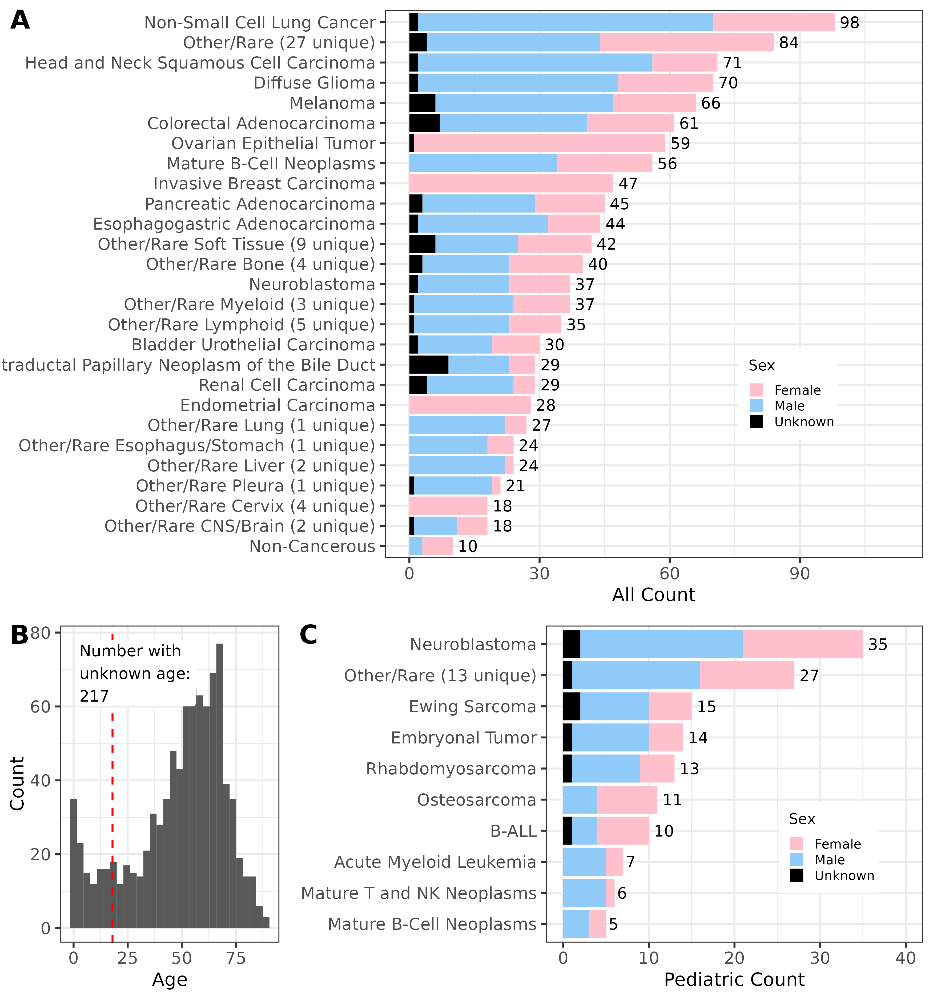
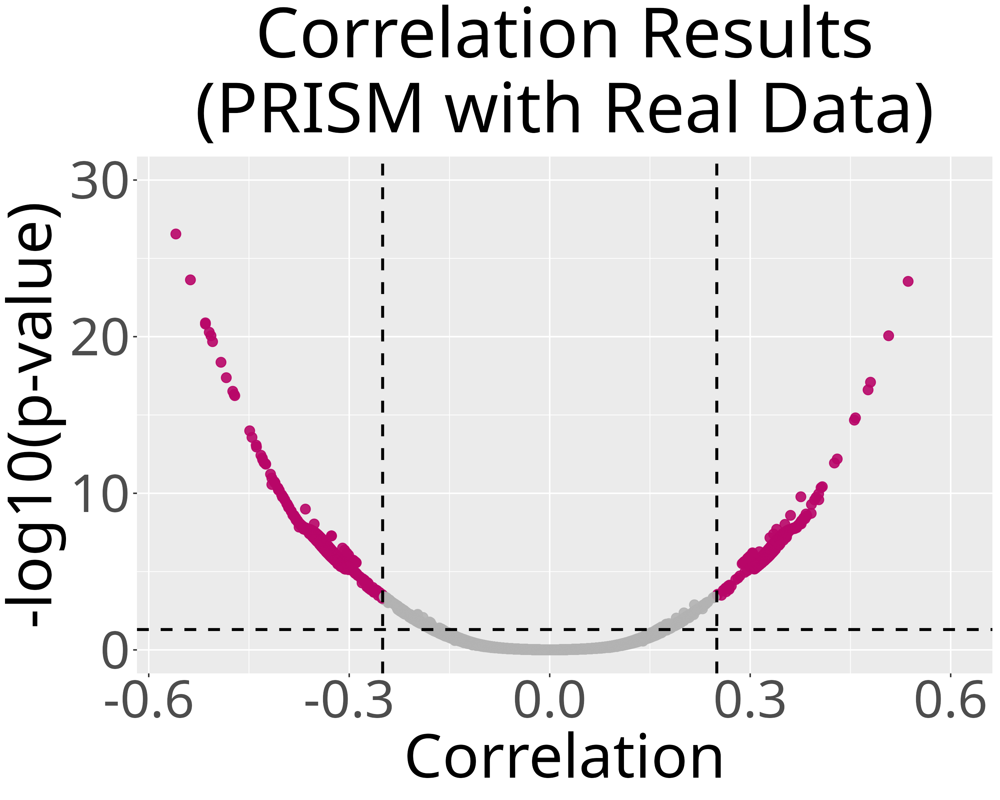

# Gene Dependency Representations

## Goal

Current cancer treatments tend to be toxic and leave patients with lifelong side effects.
The future of drug development is based on synthetic lethality, where the combination of two genetic events results in cell death.
The first molecular targeted therapeutic exploiting a synthetic lethal exposed by an inactivated tumor suppressor gene (BRCA1/2) received FDA approval in 2016, a PARP inhibitor.
Synthetic lethality-based treatments work against a majority of cancer mutations, are easier to match to responding patients, and are less toxic than traditional chemotherapy.

**The goal of this project is to discover multivariate gene vulnerability patterns in cancer.**
We use cancer cell line data from DepMap to find multivariate gene vulnerability patterns that can inform the development of novel cancer treatments.
We apply an ensemble of dimensionality reduction methods, PCA, ICA, NMF, and several VAE variants, to gene knockout data to discover multivariate gene vulnerabilities across many latent resolutions.
This ensemble approach is known as BioBombe.
We compare the resulting representations between pediatric and adult cancers, correlate them with drug response, and test whether they transfer to RNA-seq data that has no matched CRISPR screen.

## Data

All data are publicly available.
Source: [Cancer Dependency Map resource](https://depmap.org/portal/download/).
Drug response data comes from the [PRISM Repurposing screen](https://depmap.org/repurposing/), also hosted on DepMap.

## Repository structure

This repository is a numbered pipeline, meant to be run in order.

| Order | Module | Description |
| :---- | :----- | :---------- |
| [0.data-download](0.data-download/) | Download data | Download CRISPR gene effect data, cell line metadata, a QC'd gene dictionary, and the pretrained BioBombe ensemble |
| [1.data-exploration](1.data-exploration/) | Explore and split data | Visualize cell line demographics and split gene effect data into train, test, and validation sets |
| [2.prototype-VAE-models](2.prototype-VAE-models/) | Train and validate a single Beta-VAE / Beta-TC-VAE | Optimize hyperparameters, train one representative model of each type, then check it with heatmaps, GSEA, and t-tests |
| [3.run-biobombe](3.run-biobombe/) | Train and validate the full BioBombe ensemble | Sweep PCA, ICA, NMF, VanillaVAE, BetaVAE, and BetaTCVAE across many latent dimensions, run GSEA on each, then check ensemble consistency with CKA and reconstruction quality |
| [4.drug-dependency](4.drug-dependency/) | Correlate with drug response | Correlate latent dimensions with PRISM drug screen viability data |
| [5.RNAseq](5.RNAseq/) | Bridge to RNA-seq | Train models that predict each latent dimension from RNA-seq expression, for samples without a CRISPR screen |
| [6.collab-data](6.collab-data/) | Apply to external data | Apply the RNA-seq bridge to real collaborator samples and compare predicted vulnerabilities to observed cell killing |
| [7.shiny-app](7.shiny-app/) | Prepare visualization data | Build the PCA projections used by the project's Shiny app |
| [8.apply-biobombe-new-data](8.apply-biobombe-new-data/) | Apply BioBombe to new data | Align new gene dependency data to the trained ensemble's genes, sanity-check its distribution against DepMap, apply every saved model, and annotate the resulting latent scores with pathways and drugs |

## Status

The full BioBombe ensemble, `saved_models/` under [3.run-biobombe](3.run-biobombe/), is downloaded rather than trained locally.
Fetch it with [0.data-download/3.download-saved-biobombe-models-from-figshare.ipynb](0.data-download/3.download-saved-biobombe-models-from-figshare.ipynb).
A single trained Beta-VAE checkpoint is also available at [2.prototype-VAE-models/results/best_vae_model.pth](2.prototype-VAE-models/results/best_vae_model.pth).

## A visual tour

**Cell line cohort.** DepMap cell lines span many cancer types, ages, and pediatric or adult status.



**Learned latent space.** The trained Beta-VAE embeds cell lines using their gene knockout dependency scores.


**Drug response correlation.** Latent dimensions are correlated with PRISM drug screen viability to nominate candidate vulnerabilities.



## Environment setup

### Step 1: Install mamba

This environment installs PyTorch and JupyterLab, so it's large enough that conda's solver is slow.
[mamba](https://mamba.readthedocs.io/) is a drop-in, much faster replacement.

```sh
conda install -n base -c conda-forge mamba -y
```

### Step 2: Create the environment

```sh
# conda version 24.5.0
mamba env create --yes --file environment.yml
```

Plain `conda env create` also works if you'd rather skip mamba, just slower to resolve.

### Step 3: Activate the environment

```sh
conda activate gene_dependency_representations
```
