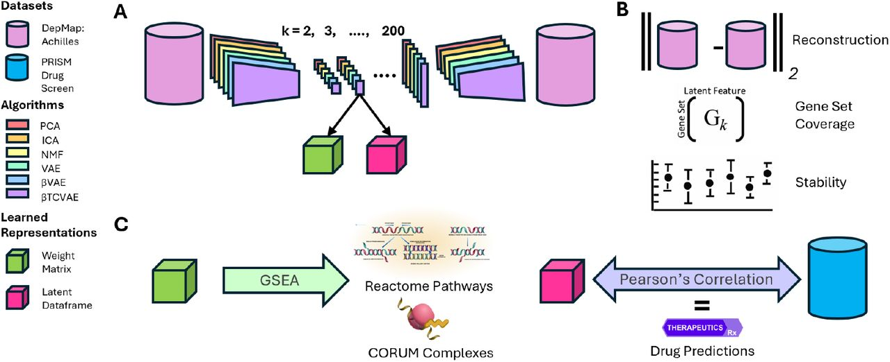

# Gene Dependency Representations

## Goal

Our goal is to discover gene process dependencies in cancer.
Gene process dependencies are groups of genes that cancer cells rely on together, not just single genes in isolation.
Our vision is to use gene process dependencies as a new category of drug targets.

## Publication

This project is described in our preprint, [Curd & Way (2025), "Characterizing the landscape of gene process dependencies in cancer"](https://www.biorxiv.org/content/10.1101/2025.11.14.688518v1).



> **Figure 1. Overview of the BioBombe framework.** (A) Six dimensionality-reduction algorithms (PCA, ICA, NMF, VAE, βVAE, βTCVAE) are each fit to DepMap Achilles CRISPR dependency data across a range of latent dimensions (k = 2–200), producing a weight matrix and a latent dataframe for every model/dimension combination. (B) We evaluate each fit by reconstruction error, gene set coverage, and stability across dimensions. (C) We interpret weight matrices via GSEA against Reactome pathways and CORUM complexes. We correlate latent dataframes with PRISM drug screen sensitivity to generate drug predictions.

Most precision oncology matches a drug to a single mutated gene, which only helps a minority of patients and runs into off-target effects.
Instead, we look for gene process dependencies: groups of genes within a shared biological process that cancer cells rely on to survive. 
Using BioBombe, we fit many dimensionality reduction models (PCA, ICA, NMF, and variational autoencoders) across a range of latent dimensions to DepMap CRISPR knockout data, then use gene set enrichment (Reactome, CORUM) to interpret the resulting gene programs and connect them to drug sensitivity.

This multi-model approach recovered known biology, like mitotic regulation and the citric acid cycle, as well as cancer type-specific vulnerabilities, including TP53 and mitochondrial pathway dependencies in glioma.
The results point to new drug repurposing candidates and an alternative to single-gene targeting for precision oncology.

## Data

### Access

All data are publicly available.

Source: [Cancer Dependency Map resource](https://depmap.org/portal/download/).

## Repository Structure:

This repository is structured as follows:

| Order | Module | Description |
| :---- | :----- | :---------- |
| [0.data-download](0.data-download/) | Download required files | Download DepMap CRISPR gene dependency/effect data and cell line metadata, and construct a gene filtering dictionary |
| [1.data-exploration](1.data-exploration/) | Explore and visualize data | Visualize cell line metadata and gene-dependency distributions, split gene effect data into balanced train/test sets, subset genes for downstream modeling, and summarize cell line demographics |
| [2.train-VAE](2.train-VAE/) | Train dimensionality-reduction models | Optimize hyperparameters and train Beta VAE / Beta TC VAE models on gene dependency data; also apply PCA, ICA, and NMF as alternative dimensionality-reduction baselines |
| [3.analysis](3.analysis/) | Analyze model outputs | Generate heatmaps of death windows by cell line and gene, run Gene Set Enrichment Analysis on latent gene signatures, run t-tests/ANOVA across demographics, compare models with CKA, and assess reconstruction quality |
| [4.gene-expression-signatures](4.gene-expression-signatures/) | Optimize and evaluate latent gene signatures | Optimize latent-dimension models (PCA/ICA/NMF/VAE/BetaVAE/BetaTCVAE) via Optuna, run GSEA on the resulting signatures, and visualize GSEA results across latent dimensions |
| [5.drug-dependency](5.drug-dependency/) | Correlate drug response with latent dimensions | Download PRISM drug repurposing screen data, correlate and t-test drug sensitivity against latent dimensions, and visualize results with pinwheel/spider plots |
| [6.RNAseq](6.RNAseq/) | Predict latent dimensions from RNAseq | Download and filter DepMap RNAseq expression data, train ElasticNet models to predict latent dimensions from expression, and correlate predictions with drug response |
| [7.collab-data](7.collab-data/) | Apply pipeline to collaborator data | Download, merge, and model collaborator-provided pediatric tumor RNA-seq data; visualize pinwheel and cell-killing plots |

## Environment Setup

Two conda environments are used in this repository:

- `environment.yml` (name: `gene_dependency_representations`) — the primary environment for data processing, model training, and Python-based analysis notebooks.
- `figure_environment.yml` (name: `gene_dependency_figures`) — a lighter environment with an R kernel (`r-irkernel`), used for the R-based figure-generation scripts (e.g. `.r` scripts under `2.train-VAE/scripts/`, `3.analysis/`, `7.collab-data/`).

Perform the following steps to set up the environment(s) necessary for processing data in this repository.

### Step 1: Create Gene Dependency Representations Environment

```sh
# Run this command to create the proper conda environment (conda version 24.5.0)

conda env create --yes --file environment.yml
```

If you need to run the R-based figure scripts, also create the figures environment:

```sh
conda env create --yes --file figure_environment.yml
```

### Step 2: Activate Gene Dependency Representations Environment

```sh
# Run this command to activate the conda environment for Gene Dependency Representations

conda activate gene_dependency_representations
```
